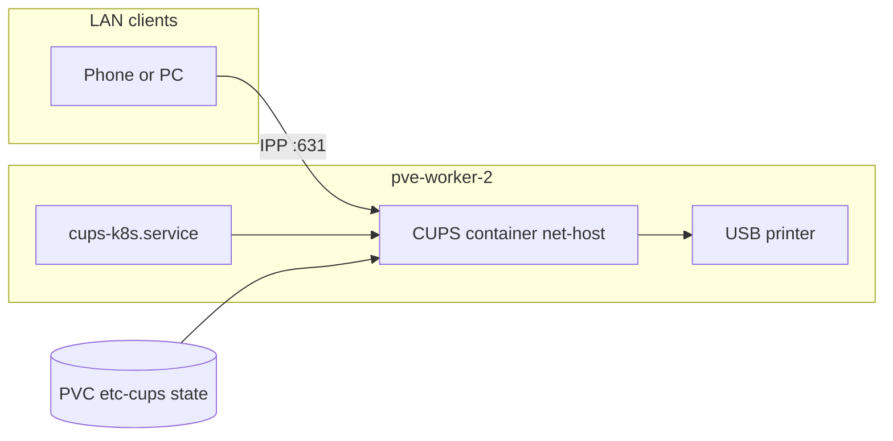

# cups-k8s

CUPS + HPLIP для USB-принтера **HP Deskjet 3050 J610 series** (`03f0:9311`) на узле `pve-worker-2`.

Репозиторий: [github.com/vutratenko/cups-k8s](https://github.com/vutratenko/cups-k8s)

## Архитектура



На кластере **Shturval/Cilium** `cupsd` внутри обычного Kubernetes pod падает с `cupsdDoSelect() failed - Bad address!`, тогда как тот же образ через `ctr run --net-host` на узле работает стабильно. Поэтому **рабочий путь сейчас — systemd unit на `pve-worker-2`**, а манифесты K8s/Argo CD оставлены для GitOps и будущего перехода, когда CRI-окружение будет совместимо.

## Печать из LAN

- IPP: `ipp://pve-worker-2/ipp/print` или `ipp://192.168.88.65:631/printers/HP_DeskJet_3050_J610`
- HTTP status: `http://pve-worker-2:631/`

Browsing/AirPrint через CUPS DNS-SD в текущем образе отключён (`Browsing Off`); при необходимости можно включить Avahi на хосте.

## Быстрый старт (production на worker)

```bash
make test
make build IMAGE=registry.sion2k.ru/home/cups-hplip:0.1.13
docker login registry.sion2k.ru
make push IMAGE=registry.sion2k.ru/home/cups-hplip:0.1.13

# на pve-worker-2 (образ уже в containerd):
sudo mkdir -p /var/lib/cups-k8s
sudo cp deploy/systemd/cups-k8s.service /etc/systemd/system/
sudo systemctl daemon-reload
sudo systemctl enable --now cups-k8s.service
sudo systemctl status cups-k8s.service
```

Проверка:

```bash
curl -sS http://pve-worker-2:631/ | head
ssh root@192.168.88.65 '/usr/local/bin/ctr -n k8s.io tasks exec --exec-id t cups-k8s lpstat -t'
```

## Kubernetes / GitOps (optional)

```bash
# один раз в namespace cups:
DOCKER_LOGIN=... DOCKER_PASSWORD=... bash deploy/scripts/apply-registry-pull-secret.sh cups

kubectl apply -f deploy/argocd/application.yaml
# Deployment по умолчанию replicas: 0 — см. README выше про CRI
kubectl apply -k deploy/base
```

Образ: `registry.sion2k.ru/home/cups-hplip:0.1.13`

## Разработка

```bash
make test          # static + entrypoint idempotency
make test-image    # docker build smoke test
make kustomize
```

Release по тегу `v*` публикует образ в Harbor (secrets `DOCKER_LOGIN`, `DOCKER_PASSWORD`).

## Ограничения

- Принтер и сервис привязаны к `pve-worker-2` и USB.
- При отключении USB bootstrap пересоздаёт очередь каждые 30 секунд.
- Для LAN нужен доступ к TCP/631 на IP worker (через `ctr --net-host`).
