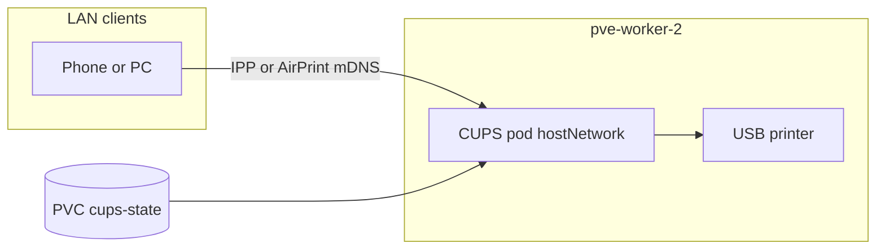

# cups-k8s

CUPS + HPLIP в Kubernetes для USB-принтера **HP Deskjet 3050 J610 series** (`03f0:9311`) на узле `pve-worker-2`.

## Архитектура



- Один `Deployment` с `hostNetwork: true` и `nodeSelector` на `pve-worker-2`.
- USB: `/dev/bus/usb`, `/dev/usb`, `/run/udev`, privileged.
- Состояние CUPS: PVC `cups-state` (`/var/lib/cups-k8s`).
- Очередь по умолчанию: `HP_DeskJet_3050_J610` (драйвер hpcups, plug-in не нужен).

## Печать из LAN

- IPP: `ipp://pve-worker-2.local:631/printers/HP_DeskJet_3050_J610`
- Или автопоиск через Bonjour/AirPrint (CUPS sharing + Avahi).

## Быстрый старт

```bash
make test
make build IMAGE=registry.sion2k.ru/home/cups-hplip:0.1.0
docker login registry.sion2k.ru
make push IMAGE=registry.sion2k.ru/home/cups-hplip:0.1.0

kubectl apply -f deploy/argocd/application.yaml
# или без Argo CD:
kubectl apply -k deploy/base
```

## Диагностика

```bash
kubectl -n cups get pods -o wide
kubectl -n cups exec -it deploy/cups -- lsusb
kubectl -n cups exec -it deploy/cups -- lpinfo -v
kubectl -n cups exec -it deploy/cups -- lpstat -t
kubectl -n cups exec -it deploy/cups -- lp -d HP_DeskJet_3050_J610 /etc/hosts
```

На хосте узла:

```bash
avahi-browse -rt _ipp._tcp
curl -sS "http://pve-worker-2.local:631/printers/HP_DeskJet_3050_J610"
```

## Ограничения

- Pod привязан к одному узлу и физическому USB; при отключении принтера фоновый bootstrap пересоздаёт очередь.
- Порт `631` на узле занят pod (`hostPort`); на `pve-worker-2` не должно быть второго CUPS на хосте.
- Обновление образа: тег в `deploy/base/kustomization.yaml` и sync Argo CD.

## GitHub Actions

- **CI** на `main` / PR: `make test`, dry-run манифестов, сборка образа.
- **Release** по тегу `v*`: push в `registry.sion2k.ru/home/cups-hplip:<version>` (нужны secrets `DOCKER_LOGIN`, `DOCKER_PASSWORD`).
